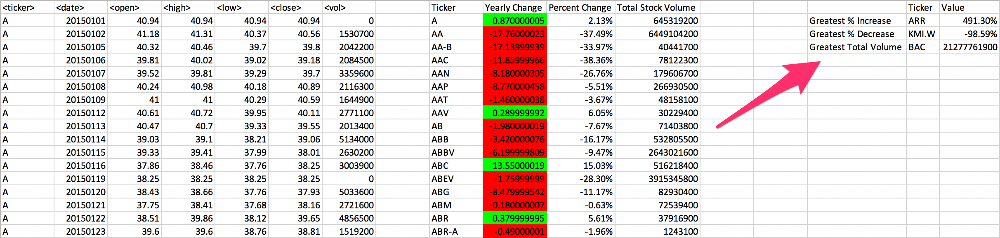

VBA - The VBA of Wall Street

## Background

VBA scripting was used to analyze real stock market data.

## The Process

The following was completed using VBA scripting:

* Each year of stock data was looped through and the total amount of volume each stock had over the year was grabed and the corresponding ticker symbol was displayed.

* A loop was created that accessed all the stocks to gather the following information:

  * Yearly change from what the stock opened the year at to what the closing price was.

  * The percent change from the what it opened the year at to what it closed.

  * The total Volume of the stock

  * Ticker symbol

* Conditional formatting was added that highlighted a positive change in green and a negative change in red.

### Hard

* Your solution will include everything from the moderate challenge.

* Your solution will also be able to locate the stock with the "Greatest % increase", "Greatest % Decrease" and "Greatest total volume".

* Solution will look as follows.

### CHALLENGE

* Make the appropriate adjustments to your script that will allow it to run on every worksheet just by running it once.

* This can be applied to any of the difficulties.

### Other Considerations

* Use the sheet `alphabetical_testing.xlsx` while developing your code. This dataset is smaller and will allow you to test faster. Your code should run on this file in less than 3-5 minutes.

* Make sure that the script acts the same on each sheet. The joy of VBA is to take the tediousness out of repetitive task and run over and over again with a click of the button.

## Submission

* To submit please upload the following to Github:

  * A screen shot for each year of your results on the Multi Year Stock Data.

  * VBA Scripts as separate files.

* After everything has been saved, create a sharable link and submit that to <https://bootcampspot-v2.com/>.

- - -

### Copyright

Coding Boot Camp © 2018. All Rights Reserved.
