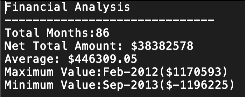
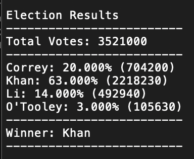

# Python

## PyBank

A Python script was created to analyze the financial records of a company.  The [dataset](PyBank/Resources/budget_data.csv) was composed of two columns: `Date` and `Profit/Losses`. 

The Python script created calculated each of the following:
  * The total number of months included in the dataset

  * The net total amount of "Profit/Losses" over the entire period

  * The average of the changes in "Profit/Losses" over the entire period

  * The greatest increase in profits (date and amount) over the entire period

  * The greatest decrease in losses (date and amount) over the entire period

In addition, the final script posses the ability to print the analysis to the terminal and export a text file with the results.

## PyPoll

The objective of this acitity was to help a small, rural town modernize its vote-counting process. The [dataset](PyPoll/Resources/election_data.csv) was composed of three columns: `Voter ID`, `County`, and `Candidate`. 

A Python script was created that analyzed the votes and calculated each of the following:

  * The total number of votes cast

  * A complete list of candidates who received votes

  * The percentage of votes each candidate won

  * The total number of votes each candidate won

  * The winner of the election based on popular vote.

* In addition, the final script provided the ability print the analysis to the terminal and export a text file with the results.

