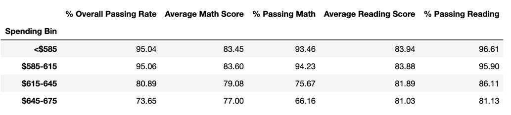

# Pandas

## Introduction
The following report is a summary of the analysis conducted on the district-wide standardized test results.  All student’s math and reading scores, as well as school budget and size were included in the analysis.  The data was aggregated in order to showcase the obvious trends in school performance to better make decisions regarding future school budgets and priorities.

## Data Overview
### District-Wide Summary

 
### School Summary
The school summary shows data for all 15 schools in the district.  

### Top Performing Schools
The table below shows the five top performing schools ranked by the overall passing rate.  

### Low Performing Schools
The table below shows the five low performing schools ranked by the overall passing rate.  

### Scores by Grade
The tables below show the average scores by grade level for the math and reading tests respectively. 

#### Math

#### Reading

### Categorical Analysis
#### School Scores by Per Student Spending 

#### School Scores by School Size 

#### School Scores by School Type 

## Recommendations/Conclusions
* Prior to making any final conclusions based on the analysis presented, special student populations, such as special education and section 504, and the services offered at each campus also should be taken into account.
* The analysis shows that schools with lower per student spending produced higher score averages.  It would be beneficial to further investigate how the schools that report higher per student spending are allocating their funds, and if those funds need to be re-allocated to other areas to help improve test scores.
* Overall it appears that the Charter schools are out performing the District schools.  Further comparison of scores, size and spending between the Charter schools and District schools could give insight into the factors that allow the Charter schools to produce higher test scores.
