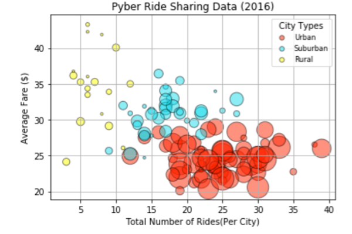
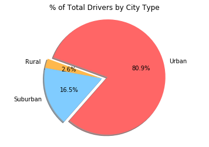
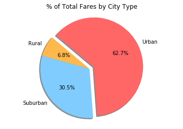
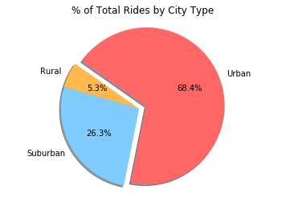

# Matplotlib

## Introduction
The following report is a summary of the analysis conducted on Pyber’s complete record set of rides.  The information examined contained information about every active driver and historic ride, highlighting city, driver count, individual fares, and city type.  The data included in this report may be used to make data-backed decisions regarding market differentiation.  

## Data Overview
The ride data analyzed spanned from January 1st, 2018 to May 8th, 2018.  In total there were 2375 ride records available.

## Recommendations/Conclusion
* Based on the record set examined, the urban city type appears to account for a large portion of Pyber’s business.  The average fare for most urban rides is lower than that of the rural and suburban city type, however 68.4% of Pyber rides were customers in the urban city type.  Therefore, urban rides account for more than half of Pyber’s fare earnings.
* The lower average fare of the urban city type could be due in part to the structure of the city.  Generally, in urban areas housing, businesses, and other establishments are located relatively close together.  This results in lower drive times and in turn lower fares.  The opposite generalization could be made regarding rural areas and its higher average fare.  
* It may be help to examine the relationship between number of drivers and number of rides in the suburban and rural city types.  It is difficult to discern from the data which variable is dependent upon the other.  Investigating this relationship further, could potentially lead to information that could increase the number of rides in the suburban and rural city types.
* When working on market differentiation strategies it may be useful to gather additional data regarding the rider’s reason for using the Pyber service.  This additional information may help explain the low ride count for the rural and suburban city types.

