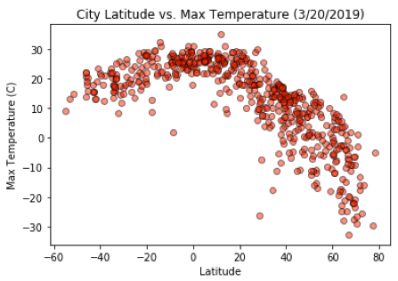
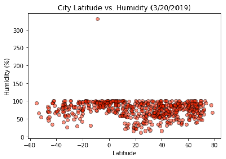
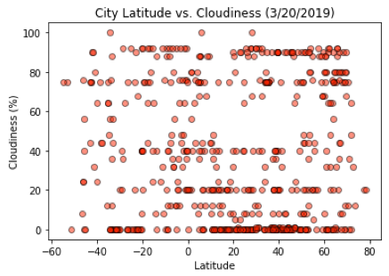
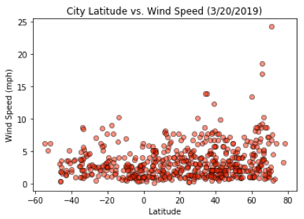

# Python & APIs

## Background

In this activity Python requests, APIs, and JSON traversals were used to answer a fundamental question: "What's the weather like as we approach the equator?"

## The Process

A Python script was created to visualize the weather of 500+ cities across the world of varying distance from the equator. To accomplish this, the python library [citipy](https://pypi.python.org/pypi/citipy) and the [OpenWeatherMap API](https://openweathermap.org/api) were used to create a representative model of weather across world cities.

A series of scatter plots were created to showcase the following relationships:

* Latitude vs. Temperature
* Latitude vs. Humidity (%)
* Latitude vs. Cloudiness (%)
* Latitude vs. Wind Speed (mph)

## Data Overview

Before examining the scatterplots below it is important to note that the equator is represented by 0 on the x-axis (latitude).  Looking at the ‘City Latitude vs. Max Temperature scatterplot we can see that cities located nearer to the equator have higher maximum temperatures.  We can also see that as latitude increases (representing north of the equator) the maximum temperature decreases much more rapidly than as the latitude decreases (representing south of the equator).

There appears to be a slight correlation between humidity and latitude near the equator.  Most cities located near the equator appear to have a humidity around 100%. 

## Recommendations/Conclusions

In order to make concrete conclusions regarding the relationship between latitude and the other three variables examined: humidity, latitude, and wind speed, it may be beneficial to examine a larger sample of cities.  It would have also been helpful to examine and possibly remove any outliers such as the 300% humidity point. One limitation encountered with the data set was that most of the cities are in urban, dense clusters which creates a biased data set as it excluded weather in rural areas.