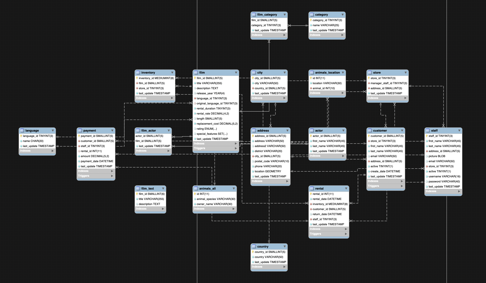
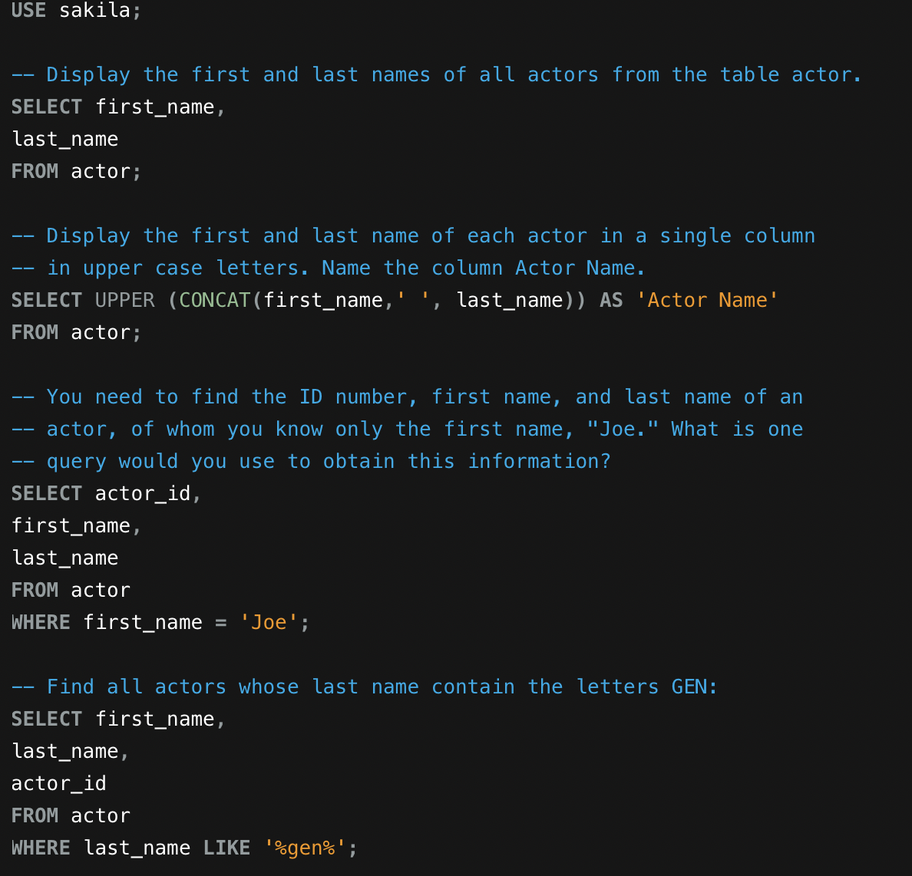

# MySQL

## Database

The Sakila database was used in this assignment.  The database is comprised of 18 relational tables that contain data for two video stores.

## Queries

Several queries were conducted using MySQL Workbench to locate information about stores, customers, and films. In addition, queries were used to edit and reformat data.  All queries conducted can be viewed [here](https://github.com/jetchechury/SMU_Assignments/blob/master/Unit_09_SQL/MySQL_Sakila_HW.sql).

