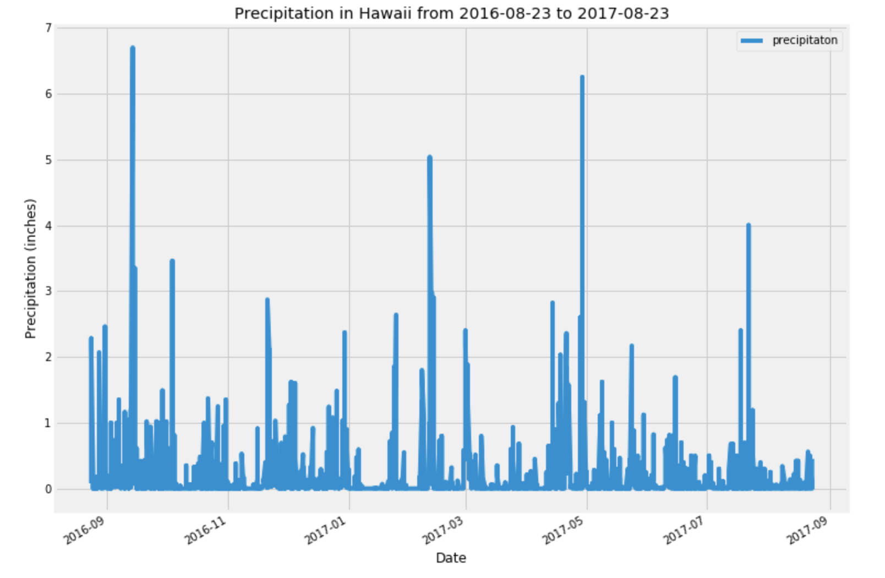
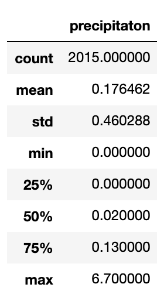
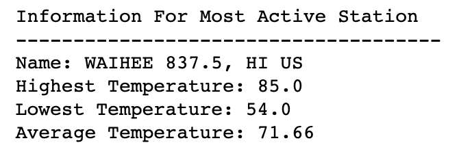
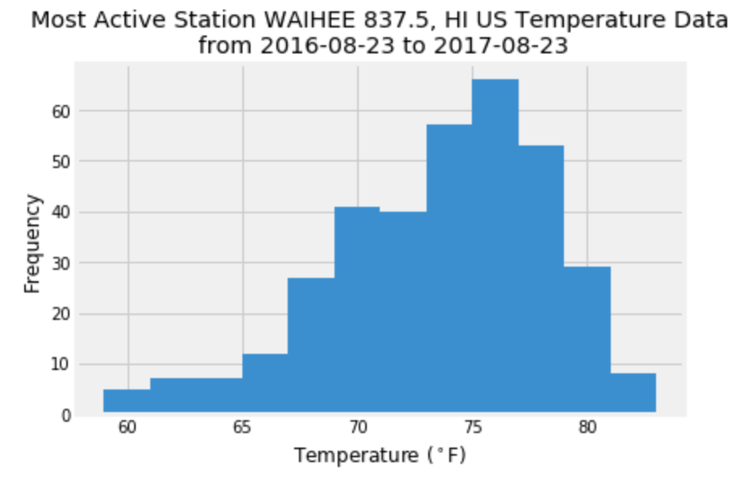
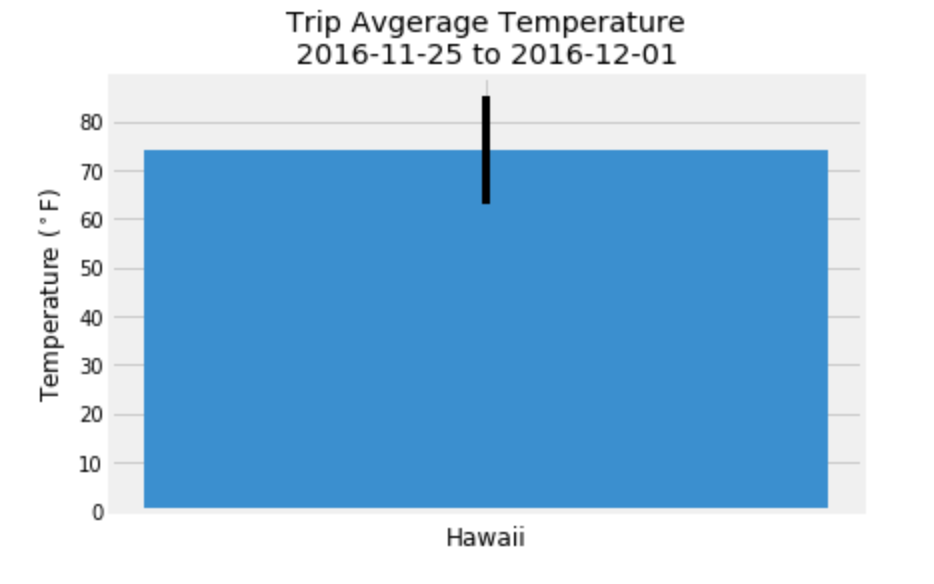
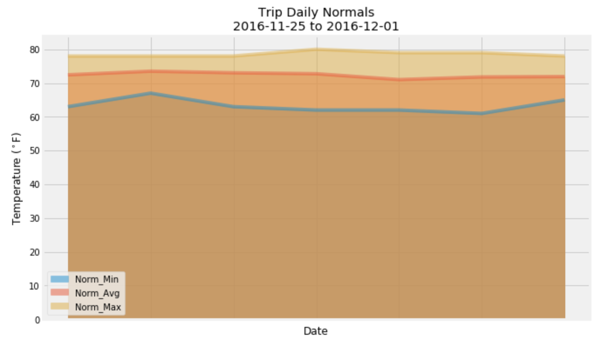

# Climate Flask App

## Background

Climate analysis was conducted on Honolulu Hawaii. 

## The Process

Python and SQLAlchemy was used to do basic climate analysis and data exploration of the climate database. In addtion, SQLAlchemy ORM queries, Pandas, and Matplotlib were used.  An engine was created to connect to the sqlite database provided and automap_base() was used to reflect the tables into classes.

### Precipitation Analysis

A query was designed to retrieve the last 12 months of precipitation data which was then loaded into a Pandas DataFrame.
The precipitation data was then plotted and summary statistics printed.

### Station Analysis

Using a query the total number of stations was calculated, and the most active station was identified. Func.min, func.max, func.avg, and func.count were used to complete the queries. 
The temperature data for the most active station was plotted.

### Temperature Analysis

The `calc_temps` function was used to calculate the min, avg,and max temperatures for the chosen dates using the matching dates from the previous year.  The min, avg, and max temperature was depicted using a bar chart.

  * Bar Height - Average temperature
  * Y Error Bar - Peak-to-Peak (tmax-tmin) value

### Daily Rainfall Average

Using the same dates thtat were used for the temperature analysis, the rainfall per weather station was calculated.  

* Calculate the daily normals. Normals are the averages for the min, avg, and max temperatures.

Using the `daily_normals` function the daily normals for a specific date was calculated. A list of dates was created and the finction was used to calculate the normals for each date string.  The results were then appended to a list.  This list was then loaded into a Pandas data frame and was used to create an area plot for the daily normals.

## The App

After completing the initial analysis, a Flask API based on the queries conducted was develeoped.  The following routes were created:

* `/` - Home page

* `/api/v1.0/precipitation` - JSON list of precipitation data

* `/api/v1.0/stations` - JSON list of stations from the dataset

* `/api/v1.0/tobs` - JSON list of temperature observations (tobs) for the previous year.

* `/api/v1.0/<start>` and `/api/v1.0/<start>/<end>`- JSON list of the minimum temperature, the average temperature, and the max temperature for a given start or start-end range.

  * When given the start only, the `TMIN`, `TAVG`, and `TMAX` for all dates greater than and equal to the start date is calculated

  * When given the start and the end date, the `TMIN`, `TAVG`, and `TMAX` for dates between the start and end date inclusive is calcualated
