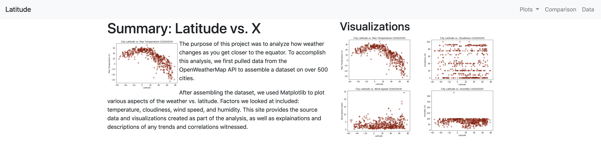

# Web Visualization Dashboard - Latitude

## Final Product
Click the link to view the final product: 
https://jetchechury.github.io/SMU_Assignments/Unit_11_Web/index.html 

## Background

The purpose of this assignment was to transform collected data into a medium that could be shared with others.  HTML and CSS were used to create a dashboard to show the data analysis conducted.

## Latitude Analysis Dashboard

In building this dashboard, individual pages for each plot a means by which to navigate between them were created. These pages contain the visualizations and their corresponding explanations. There is also a landing page, a page to view a comparison of all of the plots, and another page to view the data used to build them.  Bootstrap was used used, including the bootstrap navbar component for the header on every page, the bootstrap table component for the data page, and the bootstrap grid for responsiveness on the comparison page.  The website was designed to work at all window widths/sizes.

