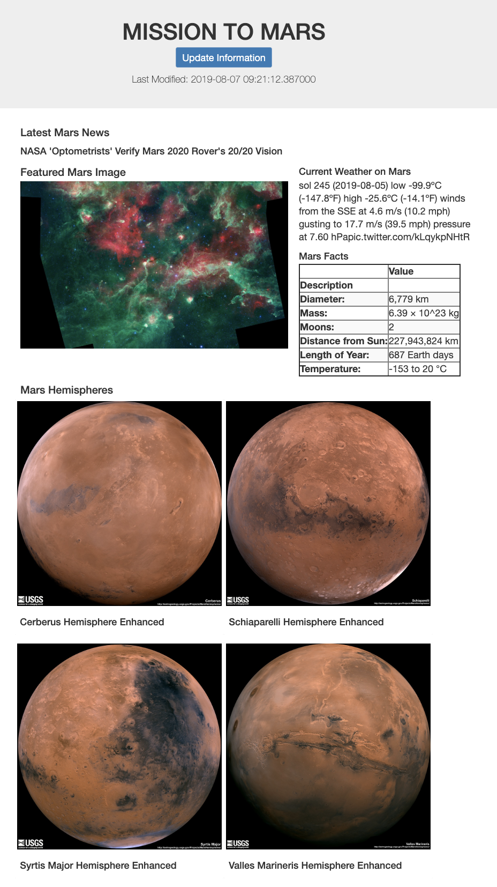

# Web Scraping - Mission to Mars

In this assignment, a web application was built that scrapes various websites for data related to the Mission to Mars and displays the information in a single HTML page.

 

## The Process

The initial scraping was completed using Jupyter Notebook, BeautifulSoup, Pandas, and Requests/Splinter. The following information was scraped:

    ### NASA Mars News
    * The NASA Mars News site was scraped and the latest News Title and Paragraph Text were collected. The text was assigned to variables so that they could be referenced later.

    ### JPL Mars Space Images - Featured Image

    * Splinter was used to navigate the site and find the image url for the current Featured Mars Image. A url string was assigned to a variable.

    ### Mars Weather

    * The browser was then pointed to the Mars Weather twitter account and the latest Mars weather tweet was scraped from the page. As with the other information, the weather tweet was assigned to a variable. 

    ### Mars Facts

    * Using Pandas, the table containing facts about the planet including Diameter, Mass, etc. was scraped into a Pandas data frame.  The table was cleaned up (unwanted columns removed, columns renamed, index reset, etc.) and the data was then converted to a HTML table srting.

    ### Mars Hemispheres

    * High resolution images for each of Mar's hemispheres was obtained by clicking each of the links to the hemispheres in order to find the image url to the full resolution image.  Using a for loop, both the image url string for the full resolution hemisphere image, and the Hemisphere title containing the hemisphere name were added to a Python dictionary.  The dictionary was then appened to a list.

## MongoDB and Flask Application

Using MongoDB with Flask templating a new HTML page that displays all of the information that was scraped from the sites above was created.  First, the Jupyter notebook was converted into a Python script (`scrape_mars.py`) with a function tasked with executing all of the scraping code.  The final portion of the function returned one Python dictionary containing all of the scraped data.

In the app.py file, a route called `/scrape` that imported the `scrape_mars.py` script and called the `scrape` function.  The return value was then stored in Mongo as a Python dictionary.  Next, a root route `/` was created.  This route was established to query the Mongo database and pass the mars data into an HTML template to display the data.

A template HTML file called `index.html` was created to take the mars data dictionary and display all of the data in the appropriate HTML elements.
