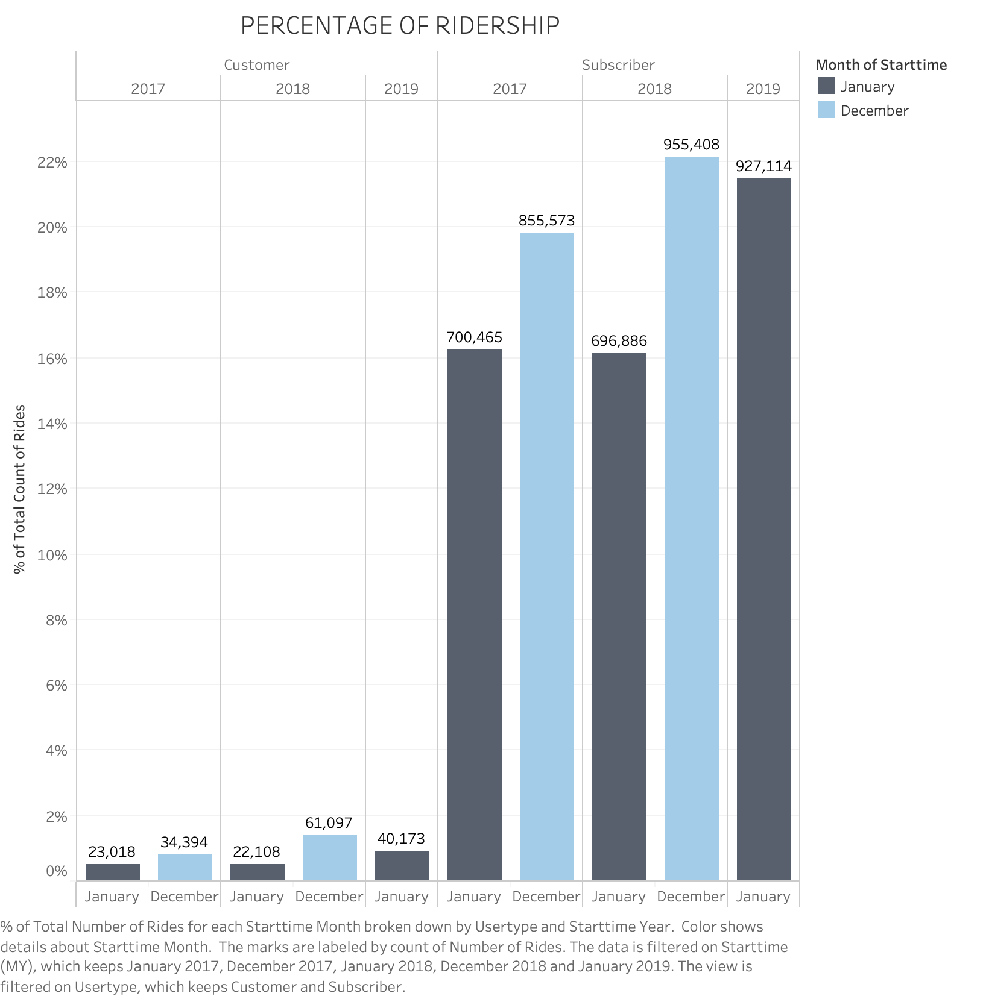
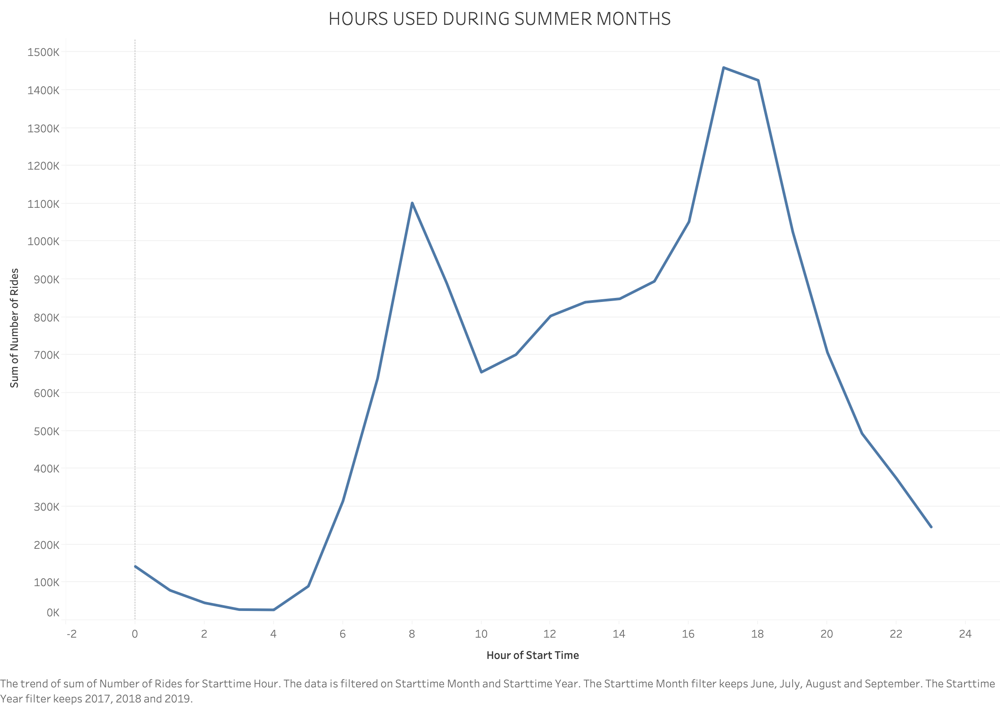
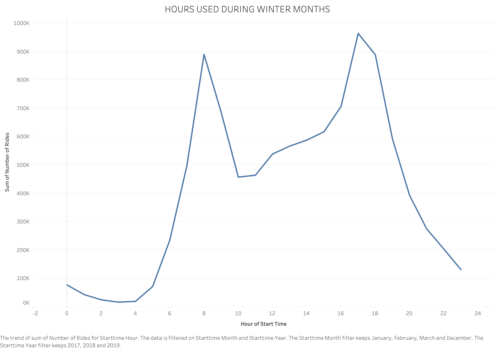

# Tableau - Citi Bike Analytics

Access the Tableau Public Story board here --> https://public.tableau.com/shared/89XQNCWG9?:display_count=yes&:origin=viz_share_link

## ABOUT THE DATA SET

### Data Collection
A CSV file for every month from June 2013 to May 2019 was downloaded using Selenium Webdriver from the [Citi Bike NYC System Data page] (https://www.citibikenyc.com/system-data). 
### Data Clean Up
After selecting a time period to examine, the files for that time period were concatenated to form one csv file.  Prior to concatenating the csv files, each file was read into a data frame and inspected to ensure that column heading and data types were the same across all files.
### Time Period
The data set referenced in this report encompasses January 2017 to May 2019 unless otherwise specified
### Size
The data set consist of information from 40,842,644 rides.
### Descriptors
The following information can be found in the data set: 
 
•	Bike ID                    
•	Birth Year                 
•	End Station ID             
•	End Station Latitude       
•	End Station Longitude      
•	End Station Name            
•	Gender (Zero=unknown; 1=male; 2=female)          
•	Start Station ID           
•	Start Station Latitude     
•	Start Station Longitude    
•	Start Station Name          
•	Start Time                  
•	Stop Time              
•	Trip Duration (seconds)      
•	User Type (Customer = 24-hour pass or 3-day pass user; Subscriber = Annual Member)   
 
## ANALYSIS
### Ridership and Membership
The proportion of short-term customers and annual subscribers have both showed an increase from January to December during 2017 and 2018.

The bar chart shows the percent of the total number of rides for January of 2017, 2018, 2019 and December of 2017 and 2018.  The left-hand side of the chart represents the customers and the right side of the chart represents the subscribers.

 
### Hours of Usage 
 
From the line graphs above, it appears that both in the winter (December, January, February, and March) and summer (June, July, August, September) months there is a  
spike in ride start times between 6 and 8AM as well as 4 and 5PM.  It is important to note that the scale on the two graphs are different.
 
### Station Popularity
  

The bar graphs above, show the top 10 starting and ending stations for the month of July.  There is little variation between starting and ending stations, as well as across years.

The map to the left shows the location of the stations at which riders started their journey.  The size of the circles corresponds to the number of rides.  The larger the circle the higher the number of rides that have started at the station.  The color of the dot also correlates to the number of rides.  From the map it appears that most of the most used stations are closer to the city center.  Upon further inspection, as seen in the second map with only the top 10 starting stations, all of the top 10 stations are located in the densely populated borough of Manhattan where users are most likely to use alternate modes of transportation due to several factors. 
 

There appears to be more variation between the bottom 10 starting and ending stations than the top 10.  It appears that most of the bottom stations are located outside of the city center in less densely populated areas.
Gender Distribution
 
In the month of July in 2017 and 2018 there were more male participants than female participants. Upon examining the percent change of gender across 2017, 2018, and 2019 there appears to be a decrease in both female and male participation between 2018 and 2019.  This is could be due to the fact that the 2019 dataset only goes till May. 

Age
Between the ages of 15 and 40 there appears to be a noticeable variation of the average trip duration where as 43+ the trip duration appears to stay steady between 12 and 16 minutes.  The spikes at approximately ages 23, 33, and 36 could be due to outliers and prompt further investigation of the data.

Trip Distance
The graph shows the average trip distance (in miles) by month.  Two and half years of data were used to calculate the averages shown.  The minimum average trip distance was 0.9876 miles in the month of January and the maximum average trip distance 1.1807 miles in the month of June.

Bike Maintenance 
It can be predicted that bikes that have traveled a larger number of miles, are most likely due for repair.  The bar chart shows the top 10 distance traveled during the time frame examined. 

Please see the Citi Bike NYC Dashboard for interactive visuals.
CONCLUSIONS

Station Locations
From the data examined, it appears that most of the widely used stations are located in Manhattan.  Although further research would need to be conducted in order to draw a solid conclusion, it can be hypothesized that with 1.5+ million people living in a 34 square mile region using traditional modes of transportation such as a car and possibly a train may prove to be more difficult than for that of a person living in a less densely populated area.  

Peak Times
When the peak times for summer and winter were analyzed, it was found that there was a spike in ride start times between 6 and 8AM as well as 4 and 5PM.  Generally speaking, these are the times when most individuals are traveling to and from work.  The phenomenon known as ‘rush hour’ occurs during these time periods.  Rush hour can cause increased travel times due to the increase of people on the roads trying to get to and from work.  It may be beneficial for commuters to take non-traditional forms of transportation, such as a Citi bike, in order to help reduce their commute time and costs.

Gender
Overall, there appears to be more male than female users.  Between 2017 and 2019 it appears that the gender outreach program has slightly increased the number of female participants.  

LIMITATIONS

Accuracy of Data
Some of the data collected may not be factual due to intentional/unintentional entries made by customers.  For example, a few records have a birth year of 18XX which is not possible.  There may be other discrepancies in the data that can result in incorrect analysis if not addressed.  In order to address this issue, any records with a birth year greater than 1949 were filtered out when using birth year as a variable during the analysis process.

